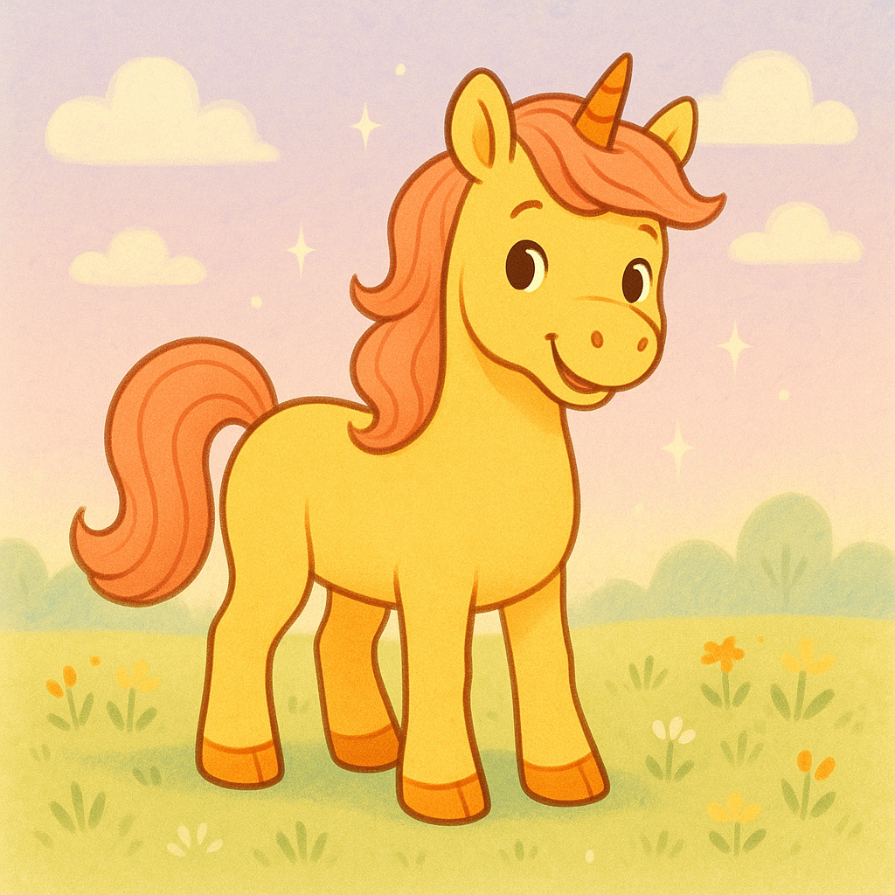

# Pony Parade

Pony Parade is a playful webpage and mini-sim where you create ponies, generate
their portraits and sprites, and watch them wander around a Ponyville map. The
site blends a kid-friendly builder UI with a live canvas scene where ponies
walk, rest, and visit spots around town. 


Pony parade was build by a 7 year old girl through conversations with Codex 5.2 High.
This description as well as everything else here was generated by Codex.



## Docs
- JavaScript modules: `docs/js-modules.md`
- Python scripts: `docs/python-scripts.md`

## What the page includes
- Pony creator form with color, talent, and vibe inputs.
- Hero portraits for each pony (stored under `assets/ponies/*.png`).
- Sprite generation + spritesheet packing for map animation.
- Ponyville map with roads, structures, decor, and moving ponies.
- Simple drives (hunger, thirst, tiredness, boredom, health) with label stats.
- Special VFX overlays for specific ponies and locations.

## Run locally
Use the local server to load the site and generate assets:

```bash
python3 scripts/pony_server.py
```

If you want to generate new assets, create a `.env` with `OPENAI_API_KEY` and use
the scripts in `scripts/` (portraits, sprites, structures, UI icons).

We are keeping track of the work on the Pony Parade community on X:
https://x.com/i/communities/2008961438069456942
