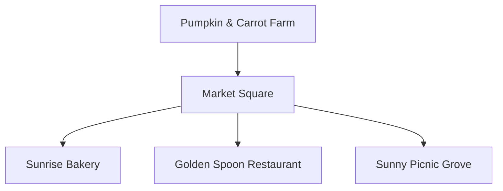
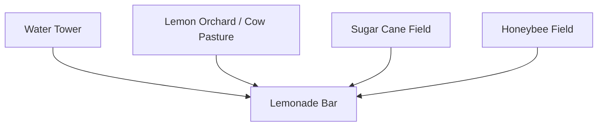
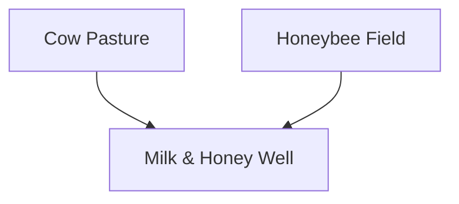
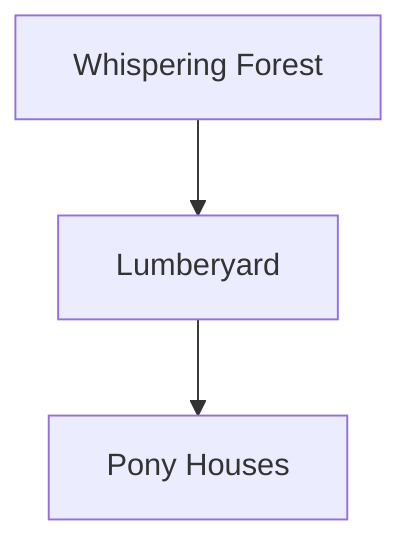

# Supply Flow Diagrams

These diagrams describe how supplies move between the new production sites, storage points, and service locations.

## Food Supply Flow

## Drink Supply Flow

Note: Lemonade uses sugar or honey as the sweetener.

## Milk & Honey Fountain Flow

## Repair Supply Flow

