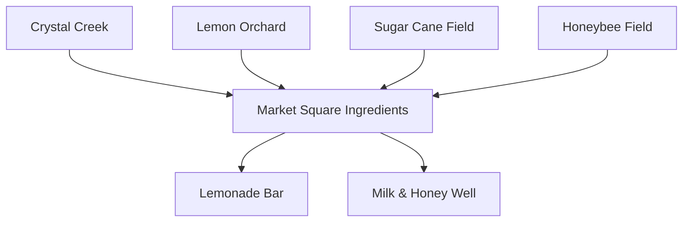
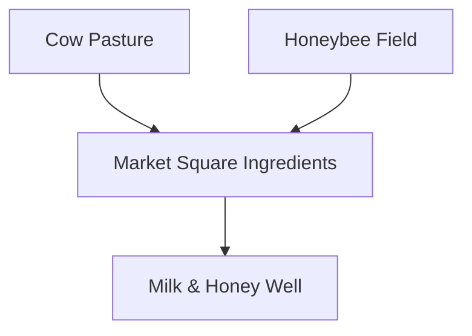
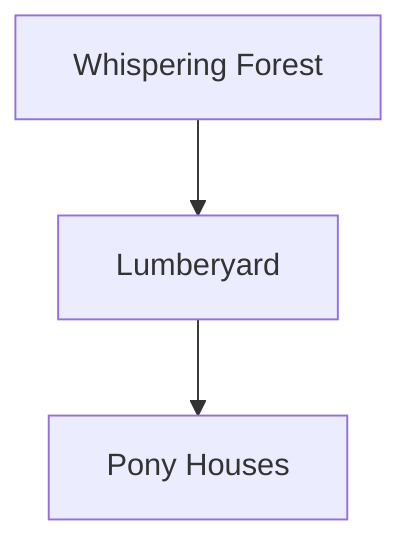

# Supply Flow Diagrams

These diagrams describe how supplies move between the new production sites, storage points, and service locations.

## Food Supply Flow

```mermaid
graph TD
  Farm[Pumpkin & Carrot Farm] --> Produce[Produce Stock (Market Square)]
  Produce --> Market[Market Square]
  Market --> Bakery[Sunrise Bakery]
  Market --> Restaurant[Golden Spoon Restaurant]
  Market --> Picnic[Sunny Picnic Grove]
```

## Drink Supply Flow



Notes:
- Lemonade uses sugar or honey as the sweetener.
- Crystal Creek refills the water ingredient for the market.
- Market Square is the drink ingredient hub and drink supply source (replacing the water tower).

## Milk & Honey Fountain Flow



## Repair Supply Flow


